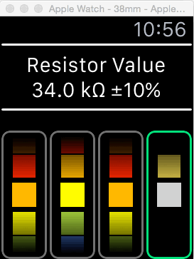

# ResistorColorCode
A simple WatchOS2 resistor color code resolver. Resistor color bands input by the user are resolved to a resistance value and tolerance. My first iOS/WatchOS/Swift applicaiton! 

